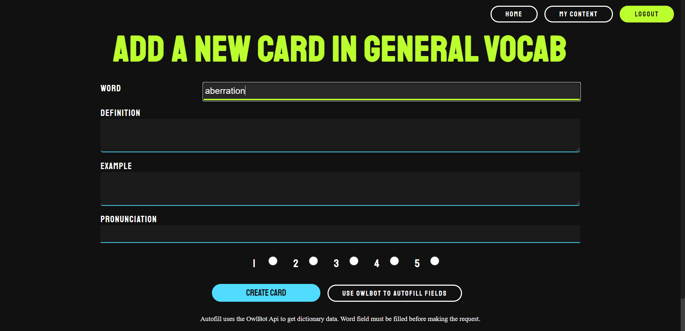
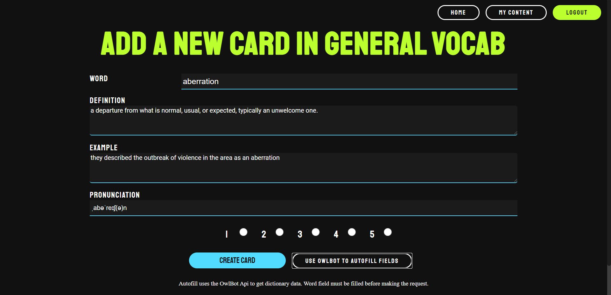
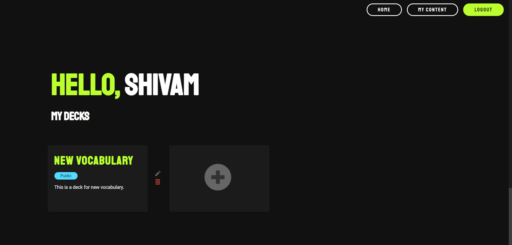
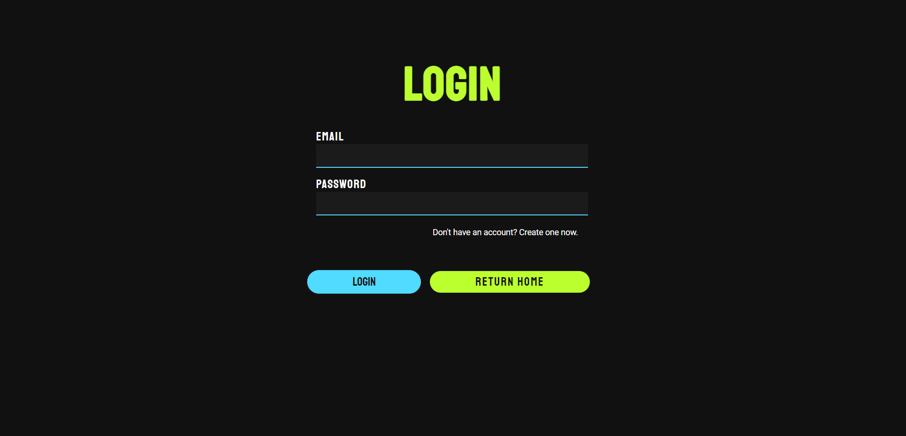

# vocabulary-builder
Vocabulary builder is a dynamic multipage website created using the **MERN** software stack. The website helps users 
consolidate and improve their vocabulary by organizing words into separate cards and their associated 
decks. Adding new decks and cards is easy, and users may also perform any of the CRUD operations. The site attempts to 
create a responsive and user-friendly webpage using pure CSS.

### Live Demo 
A live [demo](https://vocabbuilder.herokuapp.com/) has been made available using [Heroku](https://www.heroku.com/). 
**Please note** that the OwlBot autofill feature has been **disabled** for this demo. 

### Features 
- The site features user authentications using JSON Web Tokens and the [Passport](http://www.passportjs.org/) middleware for Node.js.
- Passwords are hashed using the bcrypt library and stored in a MongoDB database (this project makes use of the Mongoose ODM library).
- Users also have the option to use the [OwlBot](https://owlbot.info/) API to autofill card data and quickly add new words.
- The use of human readable slugs to quickly and easily identify and navigate to different decks
- Basic form validation and sanitization (using email-validator and sanitize-html)

#### Autofill Using OwlBot
##### Pre-Autofill

##### Post-Autofill

### Screenshots

### Author
Shivam Sood
